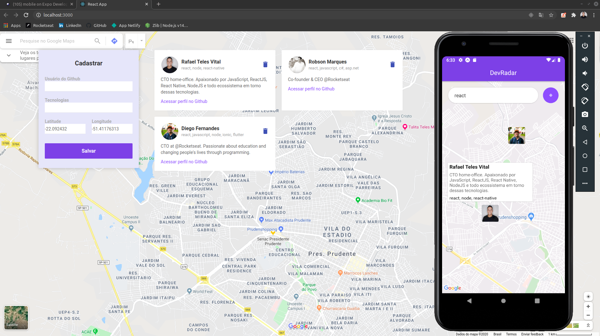
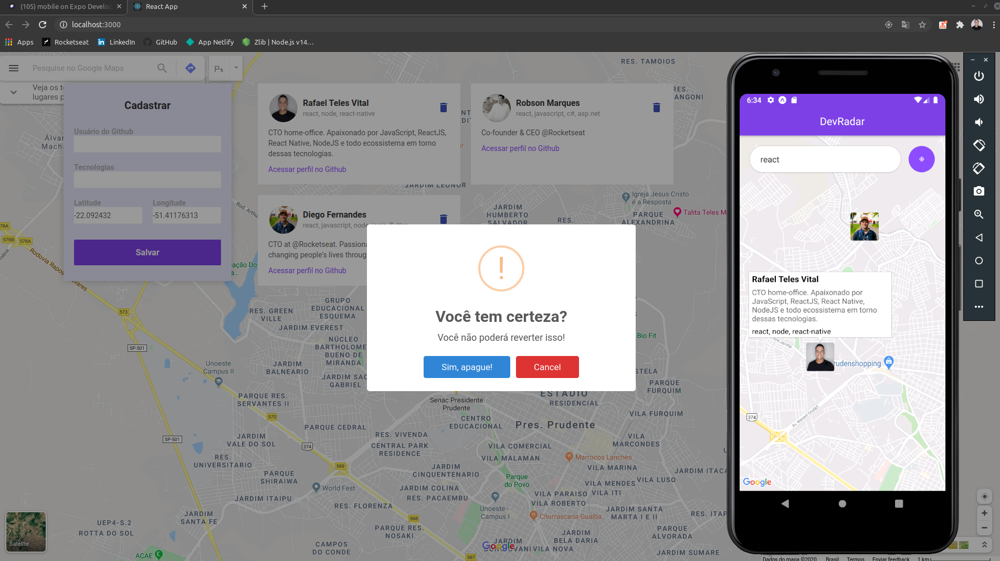
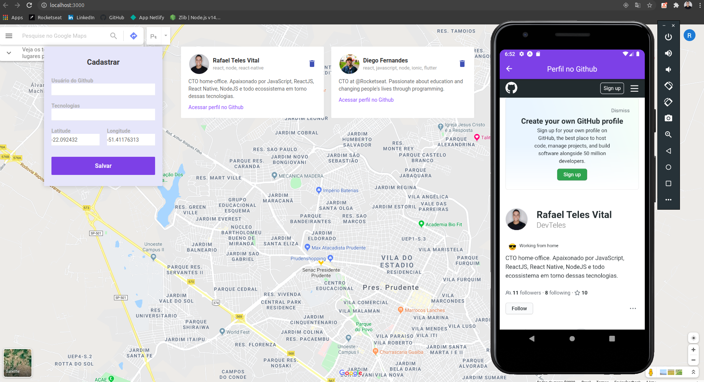

<h2>Resultado</h2>

<h1 align="center">
  DevRadar
  <br /> <br />
  
  <br /> <br />
  
    <br /> <br />
  
</h1>

# Indice
- [Sobre](#-Sobre)
- [Tecnologias utilizadas](#-Tecnologias-utilizadas)
- [Como baixar o projeto](#-Como-baixar-o-projeto)

## Sobre

Esse projeto foi criado na semana omnistack da rocketseat, durante a semana foi desenvolvido o back, front e mobile.

Tem a funcionalidade de localizar os desenvolvedores com as **skills** desejada, em um raio de 10 km ao seu redor, também sendo possível a visualização do github do dev pela webview.

No frontend foi desenvolvido a parte de cadastrar o **"dev"** com suas habilidades e no mobile você pesquisa o dev que a tecnologia que você desejar mais próximo de você.

Foi utilizado também a biblioteca socket.io, para ver no mobile em **tempo real** após o cadastramento do dev.

---

## Tecnologias utilizadas

O projeto foi desenvolvido utilizando as seguintes tecnologias

- NodeJs
- ReactJs
- React-Native
- Axios
- Expo
- react-native-maps
- socket.io-client
- react-native-webview

---
## Como baixar o projeto


```bash

  # Clonar o repositório
  $ git clone https://github.com/DevTeles/DevRadar.git
  
  # Instalar as dependências do backend, web e mobile
  $ yarn ou yarn install

  # Iniciar projeto backend
  $ yarn dev

  # Iniciar o projeto web e mobile
  $ yarn start
```

<br /><br />
Desenvolvido por **Rafael Teles Vital**
